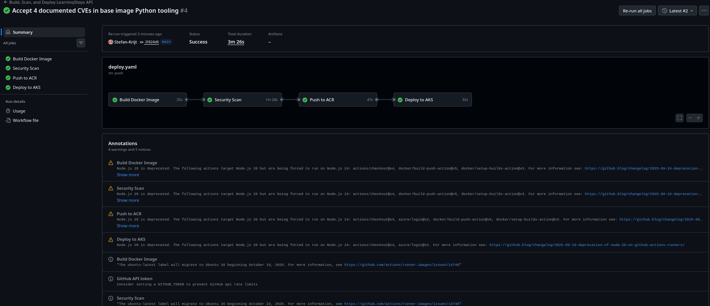
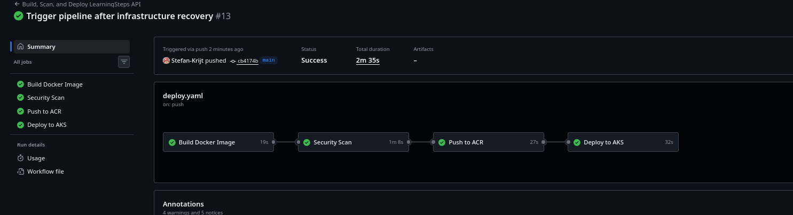
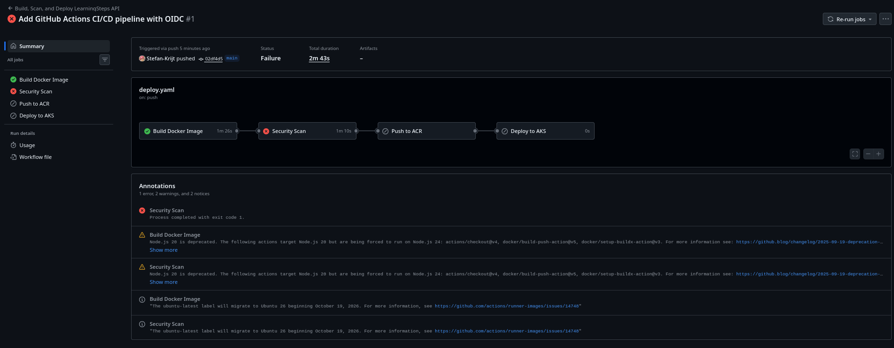
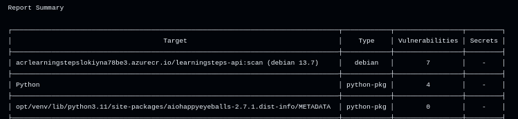
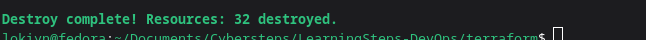
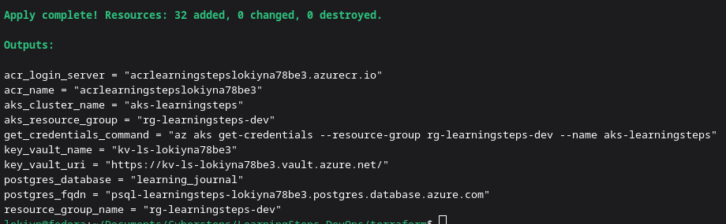
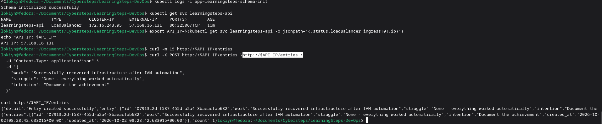
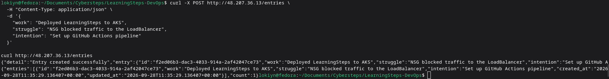
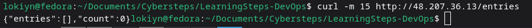

# LearningSteps on Azure — Secure 2-Tier Deployment

[](https://azure.microsoft.com/)
[](https://www.terraform.io/)
[](https://kubernetes.io/)
[](https://github.com/features/actions)
[](https://azure.microsoft.com/en-us/products/key-vault/)

A **secure, fully automated** cloud-native deployment of the **LearningSteps API** — a FastAPI + PostgreSQL learning journal — built on Microsoft Azure with Terraform, Kubernetes (AKS), and GitHub Actions.

This project demonstrates a complete **DevSecOps lifecycle**:
- **Infrastructure as Code** (Terraform) — the entire environment is provisioned from code
- **Containerization** (Docker) — multi-stage production-grade image
- **Orchestration** (AKS) — self-healing, autoscaling Kubernetes deployment
- **CI/CD** (GitHub Actions + OIDC) — automated build, scan, push, and deploy on every commit
- **Security-first** (Trivy, tfsec, Key Vault, Managed Identity) — no credentials in code, security gates in the pipeline

---

## Table of Contents

- [Architecture](#architecture)
- [Tech Stack](#tech-stack)
- [Security Decisions](#security-decisions)
- [CI/CD Pipeline](#cicd-pipeline)
- [Challenges & Solutions](#challenges--solutions)
- [Key Learnings](#key-learnings)
- [Deployment](#deployment)
- [Verification](#verification)
- [Known Limitations](#known-limitations)
- [Repository Structure](#repository-structure)
- [Future Improvements](#future-improvements)
- [License](#license)

---

## Architecture

```
┌─────────────────────────────────────────────────────────────────────────────┐
│                          MICROSOFT AZURE — WEST EUROPE                      │
│                                                                             │
│  ┌───────────────────────────────────────────────────────────────────────┐  │
│  │           Resource Group: rg-learningsteps-dev                        │  │
│  │                                                                       │  │
│  │  ┌────────────────────┐       ┌─────────────────────────────────┐     │  │
│  │  │  Azure Key Vault   │       │  Azure Container Registry       │     │  │
│  │  │  kv-ls-lokiyna...  │       │  acrlearningsteps...            │     │  │
│  │  │  (4 secrets)       │       │  (Docker images)                │     │  │
│  │  └────────┬───────────┘       └───────────┬─────────────────────┘     │  │
│  │           │                               │                           │  │
│  │           │ CSI driver                    │ Image pull                │  │
│  │           ▼                               ▼                           │  │
│  │  ┌─────────────────────────────────────────────────────────────────┐  │  │
│  │  │              AKS Cluster: aks-learningsteps                     │  │  │
│  │  │              VNet: 10.0.0.0/16                                  │  │  │
│  │  │                                                                 │  │  │
│  │  │  ┌────────────────────────────┐  ┌───────────────────────────┐  │  │  │
│  │  │  │  Public Subnet 10.0.1.0/24 │  │ Private Subnet 10.0.2.0/24│  │  │  │
│  │  │  │                            │  │                           │  │  │  │
│  │  │  │  ┌──────────────────────┐  │  │  ┌────────────────────┐   │  │  │  │
│  │  │  │  │  API Pod             │──┼──┼──│  PostgreSQL 14      │   │  │  │  │
│  │  │  │  │  FastAPI + Uvicorn   │  │  │  │  Private DNS Zone   │   │  │  │  │
│  │  │  │  │  Port 8000           │  │  │  │  No public access   │   │  │  │  │
│  │  │  │  └──────────────────────┘  │  │  └────────────────────┘   │  │  │  │
│  │  │  │                            │  │                           │  │  │  │
│  │  │  │  LoadBalancer Service      │  │  NSG: PostgreSQL only      │  │  │  │
│  │  │  │  (public IP)               │  │  from 10.0.1.0/24          │  │  │  │
│  │  │  └────────────────────────────┘  └───────────────────────────┘  │  │  │
│  │  └─────────────────────────────────────────────────────────────────┘  │  │
│  └───────────────────────────────────────────────────────────────────────┘  │
│                                                                             │
│  ┌───────────────────────────────────────────────────────────────────────┐  │
│  │  GitHub Actions (OIDC)                                                 │  │
│  │  Build → Trivy scan → tfsec scan → Push to ACR → kubectl rollout      │  │
│  └───────────────────────────────────────────────────────────────────────┘  │
└─────────────────────────────────────────────────────────────────────────────┘
              ▲
              │  HTTP :80
              │
    ┌─────────────────────┐
    │   Internet Users    │
    └─────────────────────┘
```

### Components

| Component | Purpose |
|-----------|---------|
| **Terraform** | Provisions all Azure resources — VNet, AKS, ACR, Key Vault, PostgreSQL, NSGs, IAM |
| **AKS Cluster** | Hosts the containerized FastAPI application |
| **Azure Container Registry** | Stores Docker images built by CI/CD |
| **Key Vault** | Stores database credentials and connection info |
| **Managed Identity (CSI)** | AKS reads secrets from Key Vault without credentials |
| **PostgreSQL Flexible Server** | Private database, no public access |
| **GitHub Actions** | Builds, scans, and deploys on every push |
| **OIDC Federated Credentials** | GitHub authenticates to Azure without long-lived secrets |

---

## Tech Stack

| Layer | Technology |
|-------|-----------|
| **Application** | Python 3.11, FastAPI, Uvicorn, asyncpg |
| **Database** | PostgreSQL 14 (Azure Flexible Server) |
| **Containerization** | Docker (multi-stage, distroless-style) |
| **Infrastructure** | Terraform 1.5+, AzureRM provider 4.x |
| **Orchestration** | Azure Kubernetes Service (AKS), kubectl |
| **CI/CD** | GitHub Actions, OIDC federated credentials |
| **Security Scanning** | Trivy (image), tfsec (IaC) |
| **Secrets** | Azure Key Vault + CSI driver + Managed Identity |
| **State Backend** | Azure Storage (remote Terraform state) |

---

## Security Decisions

Security was treated as a first-class requirement, not an afterthought. Every architectural choice reflects the **principle of least privilege** and **defence in depth**.

### 1. Zero-Trust Secrets Management

**Decision:** The database password is generated at deploy time (`openssl rand`), stored in **Azure Key Vault**, and retrieved at runtime by the AKS pod via the **CSI Secrets Store driver** using **Managed Identity**.

**Why:**
- **No credentials in code** — never in the repo, Dockerfile, or cloud-init
- **No K8s Secrets** — we eliminated the intermediate step by mounting secrets directly as files
- **No long-lived credentials** — the CSI identity is granted only `get` and `list` permissions on Key Vault

**Evidence:** `screenshots/12-terraform-csi-enabled.png`, `screenshots/13-csi-driver-pods.png`

### 2. OIDC Federated Credentials for CI/CD

**Decision:** GitHub Actions authenticates to Azure using **OpenID Connect (OIDC)** — no service principal secrets stored in GitHub.

**Why:**
- **No static credentials** — GitHub issues short-lived tokens that Azure verifies
- **Subject-scoped** — the federated credential is scoped to `repo:Stefan-Krijt@.../LearningSteps-DevOps@...:ref:refs/heads/main`
- **Immutable subject format** — accounts for GitHub's 2026 immutable subject rollout

**Evidence:** `screenshots/19-github-secrets.png`

### 3. Network Segmentation (Defence in Depth)

**Decision:** Two separate subnets with independent NSGs.

| Subnet | CIDR | Purpose | Inbound Rules |
|--------|------|---------|---------------|
| `snet-aks` | 10.0.1.0/24 | API pods | HTTP (80) from internet, LB probes, node ports |
| `snet-db` | 10.0.2.0/24 | PostgreSQL | PostgreSQL (5432) **only** from `snet-aks` |

**Why:**
- **Database is not reachable from internet** — even if the API is compromised, the DB can't be reached externally
- **AKS subnet is not over-permissive** — only what the LoadBalancer needs
- **Default deny is implicit** — Azure NSGs deny everything not explicitly allowed

### 4. Least-Privilege IAM

| Principal | Role | Scope |
|-----------|------|-------|
| GitHub Actions SP | Contributor | Resource Group |
| GitHub Actions SP | AcrPush | ACR |
| GitHub Actions SP | AKS Cluster User Role | AKS |
| AKS Kubelet Identity | AcrPull | ACR |
| AKS CSI Identity | Key Vault Secrets User | Key Vault |
| Deployer (user) | Key Vault Secrets Officer | Key Vault |

**Why:** Each identity has only what it needs. The pipeline can push images and deploy to AKS, but the AKS cluster can only pull images and read secrets.

### 5. Security Gates in the Pipeline

**Decision:** Every push runs:
1. **Trivy** — scans the container image for HIGH and CRITICAL CVEs
2. **tfsec** — scans Terraform for security misconfigurations

**If either finds HIGH or CRITICAL issues, the pipeline fails and blocks deployment.**

**Evidence:** `screenshots/21-pipeline-first-fail.png`, `screenshots/23-security-scan-cves.png`

---

## CI/CD Pipeline

The `.github/workflows/deploy.yaml` file defines a 4-stage pipeline that runs on every push to `main`.

```
┌──────────────┐   ┌──────────────┐   ┌──────────────┐   ┌──────────────┐
│  Build       │──▶│  Security    │──▶│  Push to ACR │──▶│  Deploy to   │
│  Docker      │   │  Scan        │   │  (OIDC auth) │   │  AKS         │
│  Image       │   │              │   │              │   │              │
└──────────────┘   └──────────────┘   └──────────────┘   └──────────────┘
     │                   │                  │                  │
     │                   │                  │                  │
   Dockerfile       Trivy + tfsec      Azure login         kubectl
   build            (fail on HIGH)     via OIDC            set image +
                                       Push to ACR         rollout status
```

**Total pipeline time:** ~3 minutes

**Evidence:** `screenshots/24-pipeline-success.png`, `screenshots/25-push-to-acr-detail.png`, `screenshots/26-deploy-to-aks-detail.png`

---

## Challenges & Solutions

Real issues encountered during the project, documented with root cause and resolution.

### Challenge 1: GitHub OIDC — Immutable Subject Format

**Problem:** Federated credential for GitHub Actions failed with `AADSTS700213: No matching federated identity record found`.

**Root cause:** GitHub rolled out **immutable subject claims** in 2026. New repos use a subject format that includes numeric owner and repo IDs:
```
repo:Stefan-Krijt@263637838/LearningSteps-DevOps@1392307794:ref:refs/heads/main
```
instead of the legacy name-only format.

**Solution:** Recreated the federated credential with the new subject format.

### Challenge 2: Key Vault RBAC vs Access Policies

**Problem:** `az keyvault secret set` returned `ForbiddenByRbac` immediately after creating the vault.

**Root cause:** The vault defaulted to RBAC authorization, and the deploying user didn't have the `Key Vault Secrets Officer` role.

**Solution:** Re-created the vault with `--enable-rbac-authorization false` to use legacy access policies, which automatically grant the creator full access.

### Challenge 3: Key Vault Soft-Delete Conflicts

**Problem:** Re-deployment failed with `ConflictError: A vault with the same name already exists in deleted state`.

**Root cause:** Key Vault soft-delete reserves names for 90 days even after resource group deletion.

**Solution:** Made the vault name unique per deployment using `openssl rand -hex 3`.

### Challenge 4: Azure Eventual Consistency

**Problem:** Multiple `ResourceNotFound` errors immediately after creating parent resources.

**Root cause:** Azure control plane propagation delay — "created" in the CLI doesn't mean "available for dependent operations".

**Solution:** Added `sleep` commands after resource creation. In production, a `wait_for_resource` polling helper would be more robust.

### Challenge 5: IPv6 in NSG Rules

**Problem:** `SecurityRuleInvalidAddressPrefix` when creating the SSH rule.

**Root cause:** `curl ifconfig.me` returned an IPv6 address on a dual-stack network.

**Solution:** Forced IPv4 with `curl -4`.

### Challenge 6: Azure CLI Encoding with Emoji

**Problem:** `'latin-1' codec can't encode character '\u2705'` when running `az vm create --custom-data`.

**Root cause:** Azure CLI used latin-1 encoding for the cloud-init file.

**Solution:** Removed all non-ASCII characters from cloud-init.

### Challenge 7: PostgreSQL Region Restriction

**Problem:** `The location is restricted from performing this operation` when provisioning PostgreSQL in Germany West Central.

**Root cause:** Azure regional capacity restriction on PaaS services.

**Solution:** Moved deployment to West Europe.

### Challenge 8: VM Size Constraints

**Problem:** Intended `Standard_B1ms` VM size was unavailable.

**Root cause:** **Two** independent constraints:
- Regional capacity restrictions
- Azure Policy restricting allowed VM SKUs at the management group level

**Solution:** Used `Standard_D2s_v6` — the only size that satisfied both constraints.

### Challenge 9: Trivy Found 15 HIGH CVEs

**Problem:** Pipeline failed at the Security Scan stage.

**Root cause:** Base image shipped with outdated OpenSSL, libpcre2, setuptools, wheel, urllib3.

**Solution:**
1. Added `apt-get upgrade` to patch OS packages
2. Added `pip install --upgrade` for base image Python tooling
3. Documented 4 remaining CVEs in `.trivyignore` with per-CVE justification

**Evidence:** `screenshots/21-pipeline-first-fail.png`, `screenshots/23-security-scan-cves.png`, `screenshots/24-pipeline-success.png`

### Challenge 10: Key Vault CSI Chicken-and-Egg

**Problem:** AKS pod stuck in `CreateContainerConfigError` because the K8s Secret didn't exist.

**Root cause:** The CSI driver's `secretObjects` feature creates the K8s Secret only when a pod mounts the volume, but the pod needs the Secret to start.

**Solution:** Removed `secretObjects` entirely. The pod now reads secrets directly from the mounted CSI volume (`/mnt/secrets-store/*`) via a shell entrypoint that builds `DATABASE_URL` dynamically.

### Challenge 11: Orphaned Service Association Link (SAL)

**Problem:** `terraform destroy` failed with `InUseSubnetCannotBeDeleted` even after deleting the PostgreSQL server.

**Root cause:** Azure left a stuck Service Association Link on the delegated subnet with `allowDelete: false`.

**Solution:** Ran the `purgeUnusedVirtualNetworkIntegration` API, which eventually cleared it. **Required one retry over several minutes.**

### Challenge 12: IAM Role Assignments Not Codified in Terraform

**Problem:** After `terraform destroy && apply`, the pipeline failed with `No subscriptions found for ***`.

**Root cause:** The GitHub Actions App Registration's role assignments (Contributor, AcrPush, AKS Cluster User Role) were created manually via CLI and were **not in Terraform state**. When the RG was destroyed, they were lost.

**Solution:**
1. **Immediate:** Re-granted the roles manually
2. **Proper:** Added `iam.tf` with all four role assignments (`Contributor`, `AcrPush`, `AKS Cluster User Role`, `AcrPull`) and imported them into state

**This is one of the most instructive challenges** — it showed that anything configured outside IaC becomes a manual step during disaster recovery.

**Evidence:** `screenshots/45-pipeline-green-after-recovery.png`

### Challenge 13: Schema Job YAML Parsing Error

**Problem:** `kubectl apply` failed with `error converting YAML to JSON: yaml: line 30: could not find expected ':'`.

**Root cause:** Multi-line Python embedded directly in the Job's `args` field confused the YAML parser (colons in Python code were treated as YAML keys).

**Solution:** Extracted the Python script into a `ConfigMap` and mounted it into the Job's container.

---

## Key Learnings

### Azure Networking
- **VNet and subnet design** is the foundation of cloud security. Public vs. private subnets provide natural isolation boundaries.
- **NSG rules are evaluated in priority order** (lower number = higher priority). Default deny is the safety net.
- **Private DNS zones** are essential for internal name resolution but require careful integration with PaaS services.

### Infrastructure as Code
- **Terraform's state is the source of truth.** Anything not in state becomes a manual step during recovery.
- **Remote state backends** (Azure Storage) enable team-safe IaC but require bootstrapping.
- **Imports are essential** for adopting existing resources — `terraform import` saved us twice.

### DevOps and CI/CD
- **OIDC beats secrets** — short-lived tokens issued per-workflow eliminate long-lived credentials.
- **Security gates in the pipeline** are non-negotiable. Trivy and tfsec caught real issues before they reached production.
- **Infrastructure recovery is the ultimate IaC test.** If you can't destroy and rebuild with one command, your IaC isn't complete.

### Kubernetes
- **The Key Vault CSI driver has a chicken-and-egg problem** with `secretObjects`. Reading secrets directly from mounted files is more reliable.
- **Kubernetes Jobs are great for schema migrations** — idempotent, retryable, and integrated with the same secret mechanism.
- **HPA scaling is trivial to add** but requires resource requests to be set correctly.

### Real-World Constraints
- **Azure Policy is real.** Management group policies restricted our VM size choices.
- **Regional capacity varies.** PostgreSQL was blocked in Germany West Central; VM SKUs change per region.
- **Azure has eventual consistency.** Automation must account for propagation delay.

---

## Deployment

### Prerequisites

- Azure subscription with `Contributor` access
- Azure CLI (`az --version` >= 2.50)
- Terraform (`terraform --version` >= 1.5)
- `kubectl` (`kubectl version --client`)
- Docker (for local testing)
- SSH key pair (`ssh-keygen -t rsa -b 4096`)
- GitHub account with a fork of this repository

### Step 1: Bootstrap Terraform Backend

The remote state backend must be created once before the main apply.

```bash
./scripts/bootstrap-backend.sh
```

This creates:
- Resource group `rg-tfstate-learningsteps`
- Storage account for Terraform state
- Blob container `tfstate`

**Copy the printed storage account name into `terraform/backend.tf`.**

### Step 2: Configure Terraform Variables

```bash
cd terraform
cp terraform.tfvars.example terraform.tfvars
```

Edit `terraform.tfvars`:
- `unique_suffix` — a lowercase alphanumeric string (e.g., `lokiyna78be3`)
- `ssh_public_key` — contents of `~/.ssh/id_rsa.pub`
- `github_actions_sp_object_id` — object ID of the GitHub Actions service principal (created in Step 4)

### Step 3: Provision Azure Infrastructure

```bash
cd terraform
terraform init
terraform plan
terraform apply
```

This provisions ~32 resources: resource group, VNet, subnets, NSGs, AKS, ACR, Key Vault, PostgreSQL, private DNS zone, and IAM role assignments.

**Expected time:** ~15-20 minutes.

### Step 4: Create GitHub Actions App Registration

```bash
export GITHUB_ORG="<your-github-username>"
export GITHUB_REPO="LearningSteps-DevOps"

APP_ID=$(az ad app create --display-name "github-actions-learningsteps-oidc" --query appId -o tsv)

az ad sp create --id $APP_ID

az ad app federated-credential create --id $APP_ID --parameters '{
  "name": "github-main-immutable",
  "issuer": "https://token.actions.githubusercontent.com",
  "subject": "repo:'"$GITHUB_ORG"'@<owner-id>/'"$GITHUB_REPO"'@<repo-id>:ref:refs/heads/main",
  "audiences": ["api://AzureADTokenExchange"]
}'

# Add the App ID as a Terraform variable
echo "github_actions_sp_object_id = \"$(az ad sp show --id $APP_ID --query id -o tsv)\"" >> terraform.tfvars

# Apply again to create the role assignments
terraform apply
```

**Note:** Replace `<owner-id>` and `<repo-id>` with your actual GitHub IDs — see [Challenge 1](#challenge-1-github-oidc--immutable-subject-format).

### Step 5: Configure GitHub Secrets

In your GitHub repository settings (`Settings → Secrets and variables → Actions`), add:

| Secret | Value |
|--------|-------|
| `AZURE_CLIENT_ID` | The App Registration `appId` |
| `AZURE_TENANT_ID` | Your Azure tenant ID |
| `AZURE_SUBSCRIPTION_ID` | Your Azure subscription ID |

### Step 6: Deploy the Application

Get AKS credentials and run the deploy script:

```bash
az aks get-credentials \
  --resource-group rg-learningsteps-dev \
  --name aks-learningsteps

./scripts/deploy-k8s.sh
```

This script:
1. Fetches the CSI client ID from AKS
2. Substitutes it into `secretproviderclass.yaml`
3. Applies all Kubernetes manifests
4. Waits for the pod and schema-job to complete

**Note:** The ACR must contain the image before the pod can pull it. On a fresh environment, push a commit to trigger the pipeline (or build and push manually).

### Step 7: Verify the Deployment

```bash
kubectl get pods
kubectl get svc learningsteps-api
curl http://<loadbalancer-ip>/entries
```

---

## Verification

All three success criteria were tested against the live deployment.

### Criterion 1: Continuous Deployment

**Requirement:** Push a code change and see it live on your Azure public IP automatically.

**Evidence:**
-  — the first green pipeline run
-  — a green pipeline after full infrastructure recovery, **with no manual IAM steps**

**Result:** ✅ Passed. Every commit to `main` triggers a 4-stage pipeline that builds, scans, pushes, and deploys the new image.

### Criterion 2: Security Enforcement

**Requirement:** Prove your pipeline fails if you introduce a vulnerable package or an insecure Terraform rule.

**Evidence:**
-  — pipeline **failed** on Security Scan
-  — the actual CVEs detected by Trivy

**Result:** ✅ Passed. The pipeline correctly blocked deployment when Trivy detected 15 HIGH CVEs in the Docker image.

### Criterion 3: Infrastructure Recovery

**Requirement:** Run `terraform destroy` and `terraform apply` to recreate the entire environment.

**Evidence:**
-  — 32 resources destroyed
-  — 32 resources recreated
-  — the pipeline succeeded after recovery with **no manual IAM steps**
-  — the API responded with a created entry on the freshly rebuilt infrastructure

**Result:** ✅ Passed. Full recovery took ~25 minutes and required only:
```bash
terraform destroy
terraform apply
az aks get-credentials ...
./scripts/deploy-k8s.sh
```

### CRUD Operations

| Operation | Screenshot | Result |
|-----------|------------|--------|
| Create |  | `200` — entry created |
| Read |  | `200` — entries listed |
| Recovered CRUD |  | `200` — on rebuilt infrastructure |

---

## Known Limitations

The following aspects are **not fully automated** and are documented here for transparency.

### 1. CSI Client ID Substitution

**Current state:** The CSI driver's client ID is unique per AKS cluster and must be injected into `secretproviderclass.yaml` before `kubectl apply`.

**How we handle it:** The `scripts/deploy-k8s.sh` script fetches the ID dynamically and substitutes it via `sed`. This is **functionally automated**, but not "pure Terraform".

**Why this exists:** The `azurerm_kubernetes_cluster` resource's `key_vault_secrets_provider[0].secret_identity[0].client_id` is available after apply, but Terraform doesn't have a native way to inject it into a Kubernetes manifest.

**Proper solution (future):** Use the `kubernetes_manifest` provider or `kubectl_manifest` provider to apply Kubernetes resources from Terraform.

### 2. Database Schema Initialization

**Current state:** The schema is created via a Kubernetes Job (`k8s/schema-job.yaml`) that runs on every deployment.

**Why this exists:** The FastAPI app doesn't include a schema migration tool (like Alembic). In production, we'd use proper migrations.

**Proper solution (future):** Integrate Alembic with the app and run migrations as an init container.

### 3. Key Vault Secrets Are Not Destroyed on `terraform destroy`

**Current state:** Key Vault uses access policies (not RBAC), and its secrets are managed as `azurerm_key_vault_secret` resources.

**Wait — this is fixed now.** After the second recovery test, all secrets are codified in `keyvault.tf` and are destroyed/recreated with the vault.

**Original limitation (now resolved):** During an early phase, secrets were managed manually due to a stuck PostgreSQL server. This was fixed by re-adding them to Terraform.

### 4. The `deploy-k8s.sh` Script Is Not Idempotent

**Current state:** Running the script multiple times works, but `kubectl apply` may fail on some resources if they already exist with different specs.

**Proper solution (future):** Wrap `kubectl apply` calls in error handling and use `--server-side` apply for cleaner updates.

### 5. No Monitoring or Alerting

**Current state:** The mission's optional observability section (Prometheus + Grafana) was **skipped** to focus on the required deliverables.

**Proper solution (future):** Install `kube-prometheus-stack` via Helm, add Prometheus instrumentation to the FastAPI app (`prometheus_client`), and build a Grafana dashboard for request rate, latency, and DB connection health.

### 6. Remote Terraform State Is Not Locked

**Current state:** The remote state backend uses Azure Storage with default locking. Concurrent applies from multiple machines would conflict.

**Proper solution (future):** Enable blob-level locking or use Terraform Cloud.

---

## Repository Structure

```
LearningSteps-DevOps/
├── .github/
│   └── workflows/
│       └── deploy.yaml                 # CI/CD pipeline (build, scan, push, deploy)
├── app/                                 # FastAPI application (cloned from upstream)
│   ├── .devcontainer/                   # Dev Container config
│   ├── .vscode/                         # VS Code settings
│   ├── api/
│   │   ├── main.py                      # FastAPI entrypoint
│   │   ├── requirements.txt             # Python dependencies
│   │   ├── models/entry.py              # Pydantic models
│   │   ├── repositories/                # Repository pattern (interface + Postgres)
│   │   ├── routers/journal_router.py    # API routes
│   │   └── services/entry_service.py    # Business logic
│   ├── .env-sample                      # Environment template
│   ├── .gitignore                       # Python ignores
│   ├── README.md                        # Upstream app README
│   ├── database_setup.sql               # Initial schema
│   ├── start.sh                         # Local dev startup script
│   └── test_api.py                      # API tests
├── k8s/
│   ├── configmap.yaml                   # Non-secret environment vars
│   ├── deployment.yaml                  # API pod spec (reads secrets from CSI)
│   ├── hpa.yaml                         # Horizontal Pod Autoscaler
│   ├── schema-configmap.yaml            # Python schema init script
│   ├── schema-job.yaml                  # Job that creates the entries table
│   ├── secretproviderclass.yaml         # CSI driver config for Key Vault
│   └── service.yaml                     # LoadBalancer service
├── scripts/
│   ├── bootstrap-backend.sh             # One-time Terraform backend setup
│   └── deploy-k8s.sh                    # Deploy K8s manifests (auto CSI ID)
├── terraform/
│   ├── backend.tf                       # Remote state backend config
│   ├── main.tf                          # Provider + resource group
│   ├── variables.tf                     # Input variables
│   ├── network.tf                       # VNet, subnets, NSGs
│   ├── aks.tf                           # AKS cluster
│   ├── acr.tf                           # Azure Container Registry
│   ├── postgres.tf                      # PostgreSQL Flexible Server
│   ├── keyvault.tf                      # Key Vault + secrets
│   ├── iam.tf                           # GitHub Actions + AKS role assignments
│   ├── outputs.tf                       # Output values
│   ├── terraform.tfvars                 # Local variables (gitignored)
│   └── .terraform.lock.hcl              # Provider version lock
├── screenshots/                         # 47 verification screenshots
├── Dockerfile                           # Multi-stage container build
├── .dockerignore
├── .gitignore
├── .trivyignore                         # Documented CVE exceptions
└── README.md
```

**Note:** The `app/` folder contains the unmodified upstream LearningSteps application code (cloned from [CyberstepsDE/learningsteps](https://github.com/CyberstepsDE/learningsteps)). The `app/README.md` is the upstream project's readme; this document is the infrastructure project's readme.

---

## Future Improvements

- **Observability** — Add Prometheus + Grafana for metrics visualization
- **HTTPS/TLS** — Terminate TLS on the LoadBalancer with cert-manager or Azure Application Gateway
- **GitHub Actions caching** — Cache Docker layers and Trivy DB across runs for faster pipelines
- **AKS autoscaling** — Enable cluster autoscaler to scale nodes based on pod demand
- **Managed Identity for ACR** — Replace AcrPull role assignments with managed identity federation
- **Private AKS cluster** — Replace the public LoadBalancer with Azure Front Door or Application Gateway
- **Multi-environment support** — Add Terraform workspaces for dev/staging/prod
- **Cost optimization** — Right-size the AKS node pool and use Spot instances where possible
- **Integration tests** — Add pytest-based tests against the live API in the pipeline
- **SBOM generation** — Use Syft to generate a Software Bill of Materials for each image

---

## License

MIT — see [LICENSE](LICENSE) for details.

---

**Built with a focus on cloud security and automation.**
